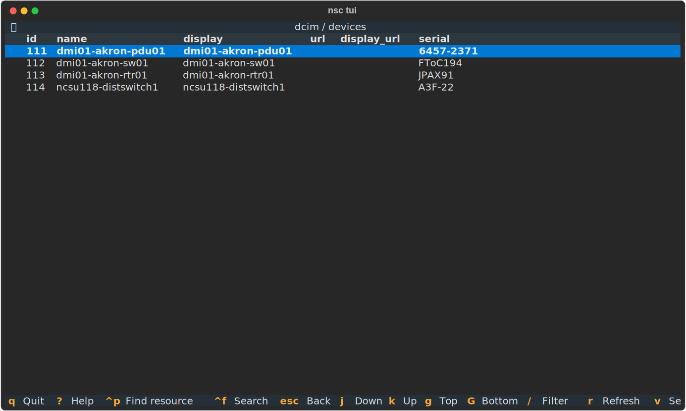
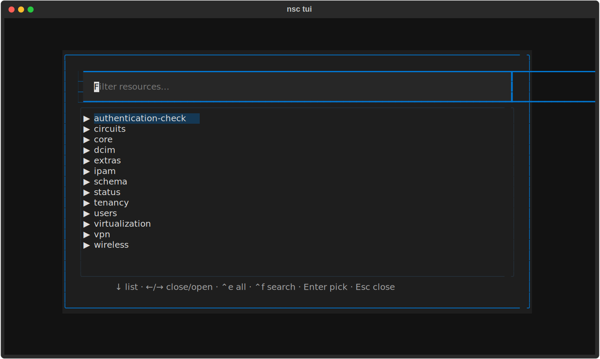
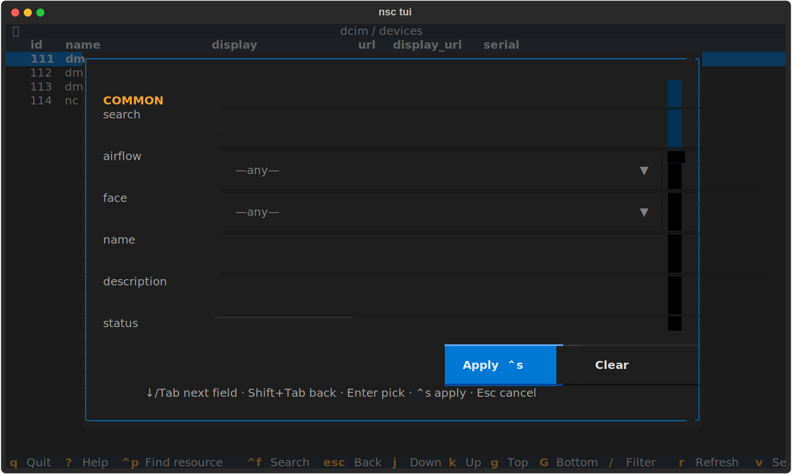
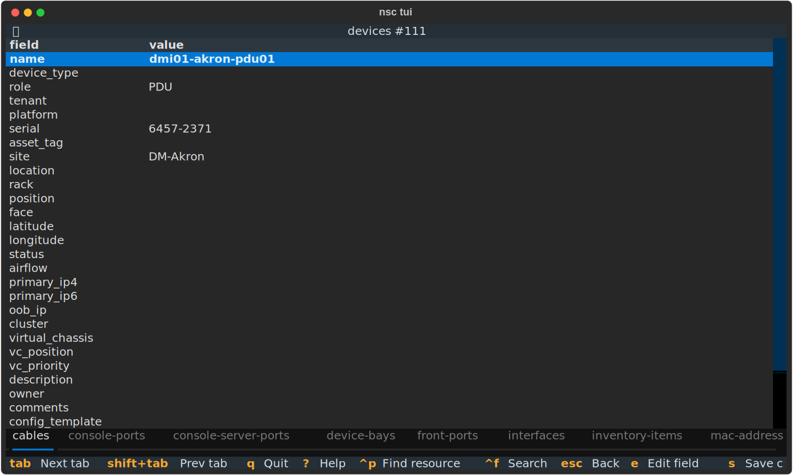
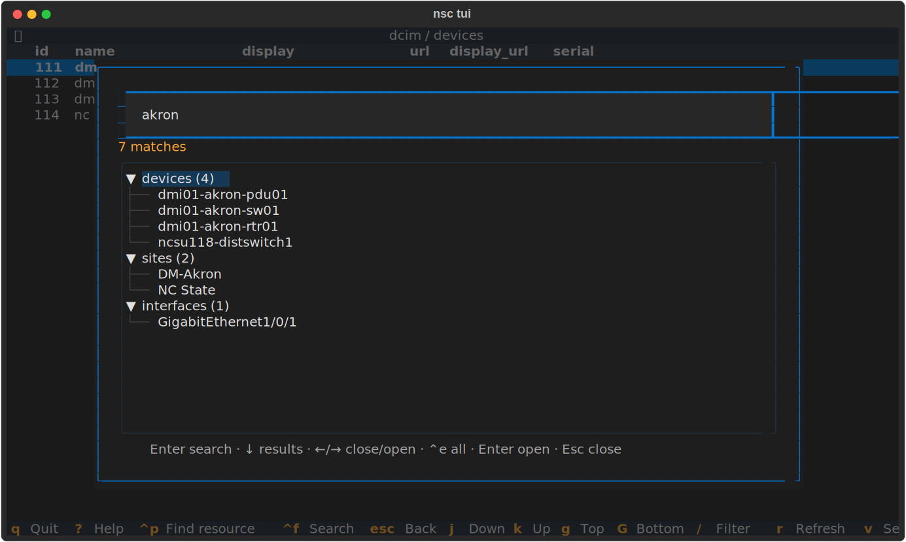

# Interactive TUI

`nsc tui` opens a full-screen, keyboard-driven terminal UI over your NetBox —
browse, filter, edit, bulk-edit and search across object types without writing a
single command. It is generated from the same OpenAPI-derived command model as
the CLI, so it works for **every** resource your NetBox exposes (plugins
included) with no per-model wiring.

```sh
nsc tui                 # land on the resource picker
nsc tui devices         # jump straight into the devices list
```

`nsc interactive` and `nsc i` are aliases of the same command.



It uses your active profile and auth exactly like the CLI. Textual (the TUI
toolkit) is imported lazily, so the normal CLI's startup time is unaffected.

!!! tip "Help is one key away"
    Press <kbd>?</kbd> on any screen for a full, always-accurate keymap — it is
    generated from the live bindings, so it can never drift from reality.

## The resource picker

With no argument, `nsc tui` lands on a **collapsible tree** of resources grouped
by category (`dcim`, `ipam`, …). It is also reachable anywhere with
<kbd>Ctrl</kbd>+<kbd>P</kbd>.



| Key | Action |
|---|---|
| <kbd>↑</kbd>/<kbd>↓</kbd> | Move |
| <kbd>→</kbd> / <kbd>←</kbd> | Open / close a group |
| <kbd>Ctrl</kbd>+<kbd>E</kbd> | Expand / collapse all |
| type | Filter — non-matching groups hide, matching ones auto-expand |
| <kbd>Enter</kbd> | Open the highlighted resource (or the top match while filtering) |
| <kbd>Ctrl</kbd>+<kbd>F</kbd> | Global search |

## Browsing a list

Opening a resource shows a paginated table.

| Key | Action |
|---|---|
| <kbd>j</kbd>/<kbd>k</kbd> or <kbd>↑</kbd>/<kbd>↓</kbd> | Move |
| <kbd>g</kbd> / <kbd>G</kbd> | Top / bottom |
| <kbd>Enter</kbd> | Open the record's detail |
| <kbd>/</kbd> | Open the filter builder |
| <kbd>r</kbd> | Refresh |
| <kbd>f</kbd> | Choose columns |
| <kbd>v</kbd> / <kbd>Space</kbd> | Toggle multi-select on a row |
| <kbd>c</kbd> | Create a new record |
| <kbd>B</kbd> | Bulk-edit the selected rows |
| <kbd>Esc</kbd> | Back |

While the list fetches, a loading wheel shows on the table; the rest of the UI
stays responsive.

## Filtering

<kbd>/</kbd> opens a **filter builder** rather than a bare text box, because a
NetBox list endpoint exposes hundreds of query parameters.



- **Common fields** — a curated form of the fields you usually filter on: the
  free-text `search`, every choice field as a dropdown, and conventional fields
  (name, status, role, site, tenant, tag, …).
- **Add filter** — a search box over *every* available parameter, including
  lookups like `name__ic` or `created__gte`.
- **Foreign keys** open the record picker, so you choose a real object (it
  applies as `…_id`) instead of guessing a slug.
- **Raw line** — type `key=value key2=value2` directly for power use.
- **Active filters** show as removable chips.

| Key | Action |
|---|---|
| <kbd>↓</kbd> | Move to the next field (from a text field) |
| <kbd>Tab</kbd> / <kbd>Shift</kbd>+<kbd>Tab</kbd> | Move between fields |
| <kbd>Ctrl</kbd>+<kbd>S</kbd> | Apply |
| <kbd>Ctrl</kbd>+<kbd>W</kbd> | Save the current filters as a named search |
| <kbd>Ctrl</kbd>+<kbd>O</kbd> | Load (or delete) a saved search |
| <kbd>Esc</kbd> | Cancel |

Applying re-queries the list. Reopening the builder shows your current filters
so you can refine them.

### Saved searches

<kbd>Ctrl</kbd>+<kbd>W</kbd> stores the current filter set as a NetBox **native
saved filter** (`extras.saved-filters`), scoped to the current resource's object
type. It then appears in the NetBox web UI's filter dropdown for that object, and
filters created in the web UI load here with <kbd>Ctrl</kbd>+<kbd>O</kbd> — the two
surfaces are interchangeable. In the load picker, <kbd>Enter</kbd> applies the
highlighted search and <kbd>d</kbd> deletes it. Re-apply one non-interactively
with `nsc <app> <resource> list --saved <name>`.

If NetBox is unreachable (offline, or you lack permission on
`extras.savedfilter`), saves and loads transparently fall back to a local store in
`~/.nsc/config.yaml` and a toast tells you the fallback was used.

## Viewing and editing a record

The detail view **is** the edit surface — there is no separate "edit window".
Move to a field and edit it in place; changes accumulate locally and are sent in
**one** `PATCH` when you save.



| Key | Action |
|---|---|
| <kbd>↑</kbd>/<kbd>↓</kbd> | Move between fields |
| <kbd>e</kbd> or <kbd>Enter</kbd> | Edit the highlighted field |
| <kbd>Enter</kbd> | (while editing) validate the value into the staging buffer |
| <kbd>s</kbd> | Save all staged changes |
| <kbd>o</kbd> | Open the related resource in the active relationship tab |
| <kbd>Tab</kbd> / <kbd>Shift</kbd>+<kbd>Tab</kbd> | Switch relationship tab |
| <kbd>d</kbd> | Delete the record (with confirmation) |
| <kbd>Esc</kbd>/<kbd>b</kbd> | Back (prompts if you have unsaved edits) |

Editing adapts to the field: choice fields validate against their options,
booleans toggle, and **foreign keys open a searchable record picker**. When a
field is read-only it says so. Editing never hard-blocks: if a foreign key's
target can't be resolved from the schema, you can enter the numeric id directly.

Pressing <kbd>s</kbd> shows a **diff** (`field: old → new`) and asks you to
confirm before anything is sent.

!!! warning "Saving applies immediately"
    Unlike the CLI's dry-run-then-`--apply` rhythm, the TUI's safety gate is the
    diff confirmation. Confirming the diff sends the `PATCH` to NetBox right
    away. Writes go through the same audited HTTP client as the CLI.

### Relationships

The detail view derives **relationship tabs** straight from the schema: from a
device you get Interfaces, Modules, Cables, and so on — any resource whose list
endpoint can filter by this one. Switch tabs with <kbd>Tab</kbd> and press
<kbd>o</kbd> to open that related list, pre-filtered to the current record.

## Bulk editing

Select rows on a list with <kbd>v</kbd>/<kbd>Space</kbd>, then press
<kbd>B</kbd>. Each field is one row: flip its **include toggle** (the switch on
the left) to opt it into the change, then set its value — a field with the toggle
off is left untouched. Custom fields appear as individual rows under their human
label. Fields are **prepopulated** with the value the selected records share, so
a small tweak doesn't mean retyping.

Press <kbd>p</kbd> to **preview** — a per-record diff of exactly what will
change (records already matching are left untouched). Confirm to apply; a
progress bar runs the updates and a summary reports any per-record failures (one
bad record never aborts the batch).

## Choosing columns

Press <kbd>f</kbd> on a list to open the column chooser.

| Key | Action |
|---|---|
| <kbd>Space</kbd> | Toggle a column |
| <kbd>Shift</kbd>+<kbd>↑</kbd>/<kbd>↓</kbd> | Reorder |
| <kbd>Enter</kbd> | Apply |
| <kbd>Esc</kbd> | Cancel |

Only top-level fields are offered — a foreign key or choice field is one column
(rendered via its display value), not a pile of `site.id` / `site.url` rows. Your
choice is **persisted per resource** to `~/.nsc/config.yaml` under `columns`, the
same config the CLI reads (and which `--columns` overrides), so it sticks across
launches and is shared between the TUI and the CLI.

## Global search

<kbd>Ctrl</kbd>+<kbd>F</kbd> (from anywhere) opens a search across many object
types at once. Type a term, press <kbd>Enter</kbd>, and matches stream in grouped
by type with a spinner while it runs; selecting a result opens its detail view.



!!! note "How it works"
    NetBox has no single global-search REST endpoint, so `nsc` approximates the
    web UI by querying a curated set of common, `q`-capable resources
    (devices, virtual machines, IP addresses, prefixes, sites, racks,
    interfaces, VLANs, VRFs, tenants, circuits, …) and merging the results.
    Niche types aren't searched here — use the resource picker for those.

## Loading and errors

Slow fetches show a loading wheel on the results area while the input stays
usable. API errors (a bad filter value, a transient network blip) are caught and
shown as a one-line message — the TUI never crashes to a traceback, and your
current view is preserved.

## Keyboard reference

Global keys work on the list and detail screens:

| Key | Action |
|---|---|
| <kbd>?</kbd> | Help overlay |
| <kbd>Ctrl</kbd>+<kbd>P</kbd> | Resource picker |
| <kbd>Ctrl</kbd>+<kbd>F</kbd> | Global search |
| <kbd>Esc</kbd> | Back |
| <kbd>q</kbd> | Quit |

The resource picker and other modals (global search, the column chooser, confirm
and diff dialogs) are focused overlays: they show their own key hints in-line and
do not bubble the global keys above — close them with <kbd>Esc</kbd> first.

The footer always shows the keys for the current screen, and <kbd>?</kbd> lists
them all. Arrow keys navigate everywhere; the list view also accepts vim-style
<kbd>j</kbd>/<kbd>k</kbd>.
